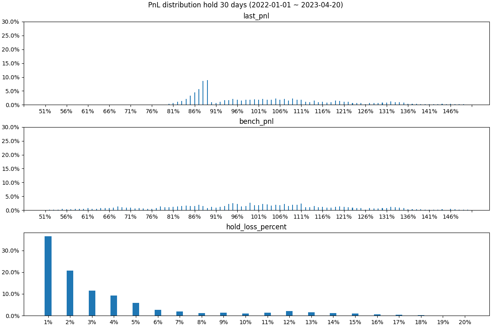
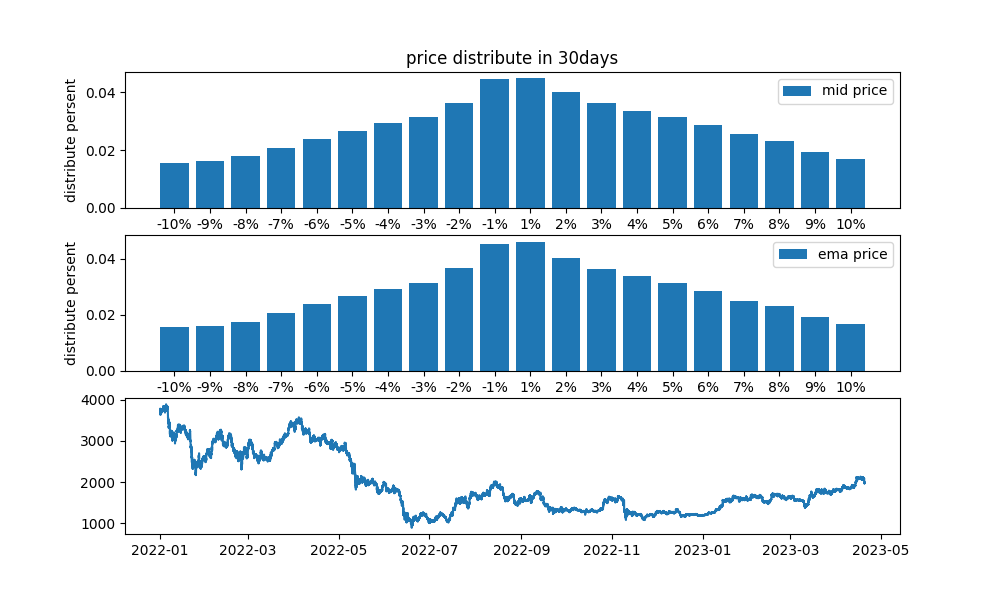

# Parameters optimizing

## Index

- [set dynamic _fee smaller](#set-dynamic-_fee-smaller)
- [set N=4 and N=5 difference](#set-N=4-and-N=5-difference)
- [Setting parameters A to 100,200 or 500?](#Setting-parameters-A-to-100%2C200-or-500%3F)
- [What will Max-LTV-crvUSD borrowers will experience?](#What-will-Max-LTV-crvUSD-borrowers-will-experience%3F)
- [Set loan_discount to 5% or 9%?](#Set-loan_discount-to-5%-or-9%%3F)

Some of crvUSD parameter research
| dynamic_fee | from 0.3% to 0.1% |
| --- | --- |
| N(band amount) | N=4 vs N=5 |
| A | 100, 200, or 500 |
| PNL of protocol | — |
| loan_discount | r=5%? 9%? |

LLAMMA has **two major pros**:

- **better LTV ratio** than MakerDao & Liquity (if users set N=4 to get the highest LTV=89.2%)
- **reversible liquidation** means if the price comes back, the user's assets mostly come back mostly

**cons:**

- **intrinsically lossy or path-dependent**
- **oracles' quality depending on the speed of value decay of users' collateral**

LLAMMA uses an oracle to sell when the price is down and to buy when the price is up, which means that arbitrageurs' profits directly come from depositors' losses. Setting a higher dynamic_fee does protect users' positions from frequent arbitrage. However, a higher dynamic_fee means arbitrageurs are waiting for bigger price spreads between AMM and oracles to arbitrage, making users suffer more losses.

##### set dynamic \_fee smaller

**Let's take an example considering 0 gas and 0 profit for arbitrageurs. Set the dynamic \_fee from 0.3% to 0.1% and see what would happen.**

ETH price = 2000, N = 4, loan_discount = r = 9%. A=100.

Bob deposited 1 ETH at 2000 and got as many crvUSD as possible.

$$
Max\ LTV ratio =
\frac{(1 - r)}{N} \cdot \sqrt{(A-1)A} \cdot (1-(\frac{A-1}{A})^N)
$$

The number of crvUSD he got will be

2000*(1-9%)/4*((100-1)_100)^0.5_(1-(100-1)^4/100^4)=**89.195%.**

He would get 1783.9 crvUSD. If the price goes below 1783.9, the liquidation begins.

|        | price_up   | price_down |
| ------ | ---------- | ---------- |
| band11 | 1820       | 1801.8     |
| band12 | 1801.8     | 1783.782   |
| band13 | 1783.782   | 1765.94418 |
| band14 | 1765.94418 | 1748.28474 |

Bob's 1 ETH will be distributed to 4 bands, each with his 0.25 ETH. When the price comes down by **0.3%** and is **1814.54** in band11.

$$
y_0 = \dfrac{(\dfrac{p\uparrow}{p_o}(A-1)x + \dfrac{p_o^2}{p\uparrow}Ay)+\sqrt{(\dfrac{p\uparrow}{p_o}(A-1)x + \dfrac{p_o^2}{p\uparrow}Ay)^2+4p_oA·xy}}{2p_oA}
$$

- **dynamic_fee = 0.3%.** After arbitraging 1 time, arbitrageurs' exchange avg price is 1802.13 profit rate = 0.6839%
- **dynamic_fee = 0.1%.** After arbitraging 3 times, each time when the price falls by **0.1%,** arbitrageurs' exchange avg price is 1802.13 profit rate = 0.2166%

**Obviously, there are more losses if we set dynamic_fee to 0.3%. What will happen if we set dynamic_fee to 0.1% and even lower or 0.**

###### set N=4 and N=5 difference

Users get different Max LTV ratios and health and loss limits.

###### Setting parameters A to 100,200 or 500?

We found an exciting thing. If you set bigger A, **arbitrageurs** will get bigger $y_0$ which means arbitrageurs will get fewer assets and fewer losses for users. Of course, a bigger A will lead to many other problems like higher gas and less arbitrage. However, sometimes bigger A will lead p_out to jump out of active_band easier and cause more significant losses for users or profit for arbitrageurs.

###### What will Max-LTV-crvUSD borrowers will experience?

From 2022-01-01 to 2023-04-20, Bob chose an arbitrary time to deposit his ETH, got max crvUSD, and held crvUSD for 30 days to get a payoff.

- Maybe the ETH price went up; thus, after returning crvUSD, he will get a positive return because ETH jump。
- Maybe ETH price dump after getting crvUSD, so his ETH cannot be returned, so he holds his crvUSD just like he had sold his ETH at a debt/collateral ratio.
- Maybe ETH price dump and pump so liquidations or arbitrages happen frequently, or the price jumped too sharp, so your collateral ETH will be indeed discount liquidated with a 6% bonus for discount liquidators.

If every 15 minutes from 2022-01-01 to 2023-04-20, a user like Bob is using Max-LTV-crvUSD to sell his ETH. The probability distribution of his return is following.

- Chart 1 -last_pnl:
  crvUSD protocol's PNL. Assuming there is no traditional liquidation—every user's ETH is in the protocol's PNL& probability.
  In most cases, positions stay at around 89%, and a minority of positions remain below 89%, which means Max-LTV-crvUSD borrowers will not likely cause damage to protocol because places below 89% means protocol will have to undertake responsibility for liquidations.
- Chart 2-bench_pnl:
  In contrast to traditional collateral stablecoin protocols, Each user's collateral pnl
- Chart3-hold_loss_percent:
  Considering gas and profit, if the spreads between AMM price and oracle price is above 0.5%, the arbitrage happened—arbitrageurs' profit probability distribution of his returns.

###### Set loan_discount to 5% or 9%?

Mid price: 5 Min Candlestick Charts from Binance (high price + low price)/2

EMA price： EMA of Mid-price

Price movements between 30 days follow a normal distribution.

**set loan_discount= r=5%. When there is a price dump, 60% of the dump will not trigger arbitraging.**

**set loan_discount=r=9%. When there is a price dump, 90% of the dump will not trigger arbitraging.**
