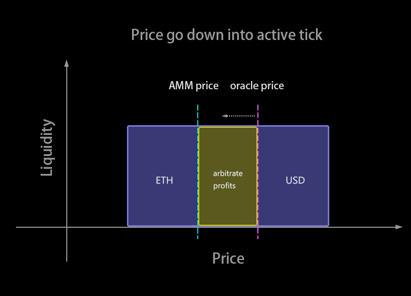
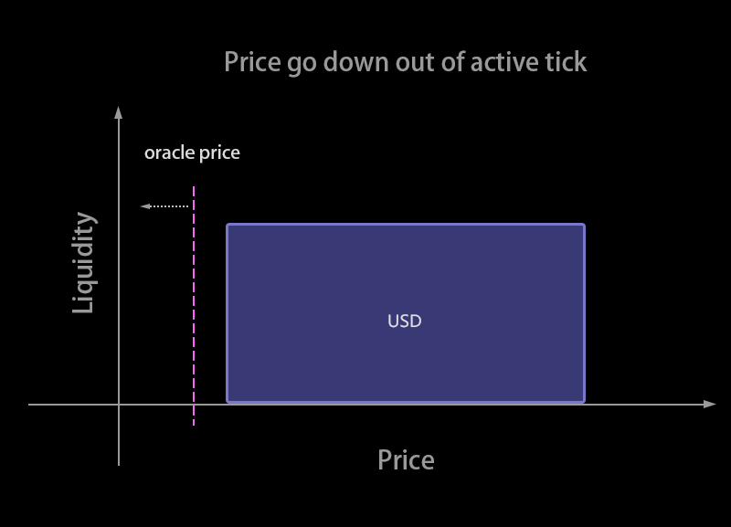
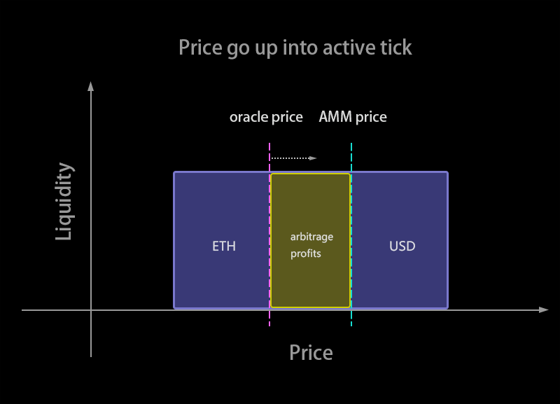
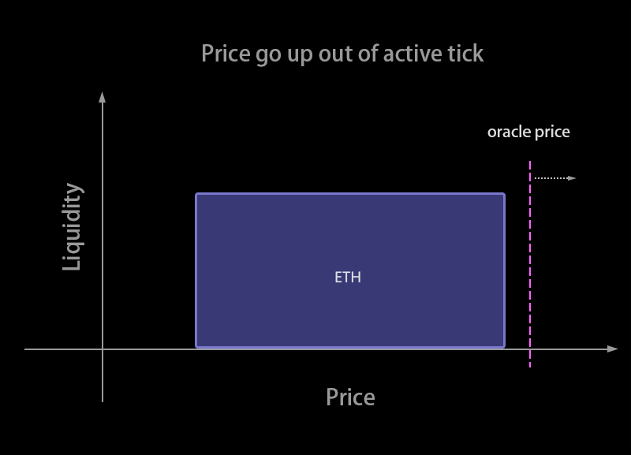
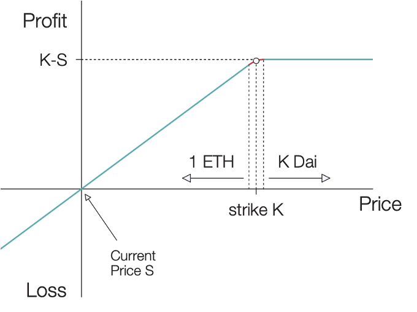
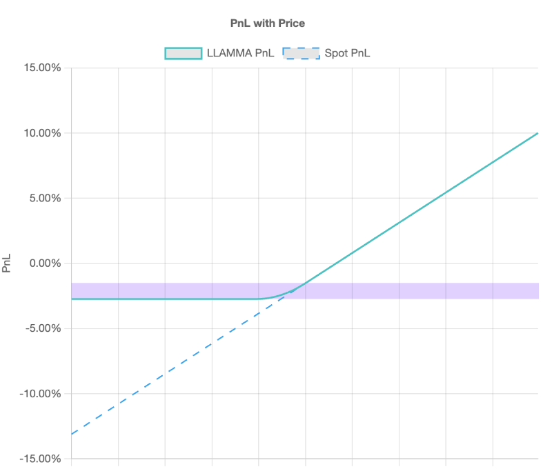

# Proposal to fund crvUSD Research

## Index

- [Overview](#Overview)
  - [Sentence summary](#sentence-summary)
  - [Summary](#Summary)
- [Proposers](#Proposers)
  - [Team overview](#Team-overview)
  - [Team roles and responsibilities](#Team-roles-and-responsibilities)
- [Specifications](#Specifications)
  - [Previous works](#Previous-works)
  - [Research plan](#Research-plan)
    - [Parameters optimizing](#Parameters-optimizing)
    - [Series articles and videos](#Series-articles-and-videos)
    - [Exploring other LLAMMA's features like leveraged crvUSD & call-options-like crvUSD](#Exploring-other-LLAMMA's-features-like-leveraged-crvUSD-&-call-options-like-crvUSD)
- [One-year roadmap](#One-year-roadmap)
- [Budget](#Budget)
  - [Salaries](#Salaries)
  - [Infrastructure, and operational costs](#Infrastructure%2C-and-operational-costs)

## Overview

### Sentence summary

- We are applying for a **$230,000 grant for 3 people for half year to fully support Curve Research Hub,** including building tools of crvUSD which contains **crvUSDsim** to check onboarding new collateral, as well as explanation articles and videos of codes, math, mechanism, and security of Curve and crvUSD.

### Summary

We aim to build **crvUSDsim** to check onboarding new collateral and give in-depth reports measuring the risk and performance of crvUSD quarterly. And build tools to promote Curve ecosystem, including leveraged crvUSD & call-options-like crvUSD. Help to build a research platform to provide developers and users with more in-depth information.
**The specific products to be delivered are as follows:**

- parameter optimization reports and crvUSDsim (similar to [curvesim](https://github.com/curveresearch/curvesim)) to check onboarding new collateral (More details refer to [Parameters optimizing](#Parameters-optimizing))
- crvUSD arbitrageur's behavior analytic
- Curve Research Hub's official website
- crvUSD_book, Curve_V1_book, Curve_V2_book (similar to [UniswapV3Book](https://uniswapv3book.com/) to guide you through the development of Uniswap)
- Series of articles analyzing the performance of crvUSD, Curve V1&V2
- Oracle mechanism of crvUSD and other oracle-dependent AMMs
- Developing tools for users to use leveraged crvUSD & call-options-like crvUSD

## Proposers

### Team overview

- **0xstan** has focused on DeFi mechanism and smart contract development research in the past two years. He has output many excellent articles, including Curve V1, V2, crvUSD mechanism and code analysis, and building [crvUSD-simulator (visual version and TypeScript implementation)](https://crvusd.0xreviews.xyz/).
- **0xmc** has been focusing on DeFi mechanism & math research and has been good at building analytic models in the past two years. He is skilled at explaining complex issues straightforwardly to help people understand the construction of protocols, especially the mathematical principles involved.
- **paco0x** has been developing DeFi-related products for two years and has had some deep research related to Dex, L2, and some other cutting-edge blockchain innovations.

### Team roles and responsibilities

- 0xstan: Full Stack Engineer, contracts Lead
- 0xmc: analytic & math model providing, reports Writing
- paco0x: research, contracts development & security

## Specifications

### Previous works

- **A website visualizing the principle of crvUSD** trying to help people understand crvUSD: [crvusd.0xreviews.xyz](https://crvusd.0xreviews.xyz/)
- **A supplementary article for crvUSD's whitepaper** for those who find it too hard to understand but are familiar with Uniswap V3: [https://0xreviews.xyz/pdf/From_Uniswap_v3_to_crvUSD_LLAMMA.pdf](https://0xreviews.xyz/pdf/From_Uniswap_v3_to_crvUSD_LLAMMA.pdf)
- **An article explaining the mechanism of crvUSD** [https://paco0x.org/curve-stablecoin](https://paco0x.org/curve-stablecoin/)
- **other things about Curve V1&V2**

[Click here to see 12 more previous works.](./PreviousWork.md)

### Research plan

#### Parameters optimizing

crvUSDsim is a tool simulating crvUSD pools with optimal arbitrageurs trading against them to check parameters for onboarding new collateral. Its primary use is to determine optimal A (a measure of the concentration of liquidity), fee parameters, loan_discount given historical price and volume feeds, liquidation_discount, policy_rate.

**Features**

- Simulate interactions with crvUSD pools in Python
- Analyze the effects of parameter changes on pool performance
- Develop custom simulation tools for parameters optimization
- Simulate the anti-risk ability of the protocol in extreme cases

**crvUSDsim roadmap**

- crvUSD Python implementation
- Data module: Asset historical data (Coingecko, Nomics) and crvUSD historical status (Subgraph)
- Arbitrage module: Participate in arbitrage in historical backtesting, simulate arbitrage with different risk preferences and different arbitrage strategies
- Parameter iteration module: Optimize different parameter combinations
- Data backtesting framework:
  Simulate backtesting based on historical data and different situations (such as different risk preferences of arbitrageurs and different interest rate models), evaluate the results, and visualize them.

For more details, see what we are doing briefly [Parameters optimizing.md](./ParameterOptimizing.md).

#### Series articles and videos

- Writing articles to help people understand the crvUSD's principles
- Making videos for introducing crvUSD to people.
- Parameters researching
- Following other oracle-depending AMM projects' methods

**Explanations about crvUSD(video in the process)**
Bob bought 1 ETH for 2,000 USDT and added 1 ETH to the protocol setting r = 9%, N = 5
|  |  |  |
| - | - | - |
|  |  | - |

#### Exploring other LLAMMA's features like leveraged crvUSD & call-options-like crvUSD

Help to build leveraged crvUSD UI or website since many people want crvUSD to get an Euler-Finance-like leverage.

For example, set loan_discount below 5% and N=4, users will use crvUSD to get an American-style-call-option payoff with lower option fees (Because users will lose intrinsic value through every liquidation by arbitrageurs, however, the cost or the loss doesn't necessarily happen)

**Uniswap V3 LP selling call option vs. crvUSD buying call option**

|  |  |
| ------------------------------------------------------------------------------- | ------------------------------------------------------------------------------- |

## One-year roadmap

We will only apply for the following grant for the second half-year if we can achieve the goals set for the first half-year.

**2023 Q2**

- crvUSD parameters researching
- crvUSDbook
- crvUSD arbitrageurs' behavior analytic

**2023 Q3**

- optimizing tools (crvUSDsim)
- crvUSD pool visualizing
- crvUSD, Curve V1&V2 videos

**2023 Q4**

- writing reports measuring risk and performances
- CurveV1_book, CurveV2_book
- oracle mechanism

**2024 Q1**

- leveraged crvUSD opportunity
- Exploring other LLAMMA's features like call options
- Curve research hub website

## Budget

### Salaries

- **Total: $225,000**
  - 0xstan: Full-time (40h/w) - $100,000 for a half year
  - 0xmc: Full-time (40h/w) - $100,000 for a half year
  - paco0x: Part-time (10h/w) - $25,000 for a half year

#### Payments

Both payment methods are acceptable, with payment 2 preferred.

1. Pay for 6 months.
2. Pay quarter for 3 months. Before another quarter payment, there will be a review.

### Infrastructure, and operational costs

Infrastructure costs are estimated. Unused funds at the end of the grant period will be returned to the DAO.

**Total: $5,000**

- Domain names & ENS: $100
- Cloud services (Hosting, static public IPs, CDN, load balancer): $3000 ($500 \* 6)
- Archival node access for Ethereum mainnet: $300 ($49/m on Alchemy)
- Operational costs (gas costs for contract deployments & transactions): $1600.
  Unused funds at the end of the grant period will be returned to the DAO.
